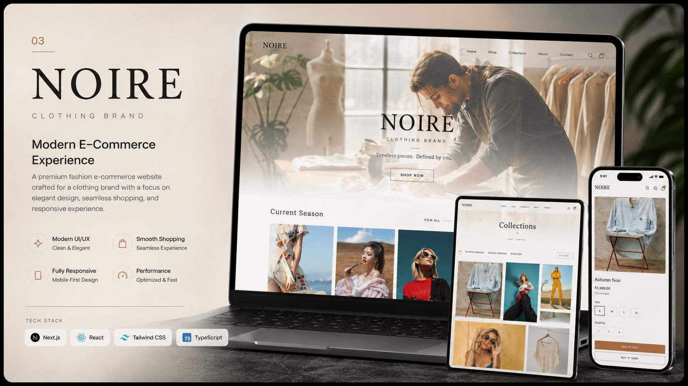
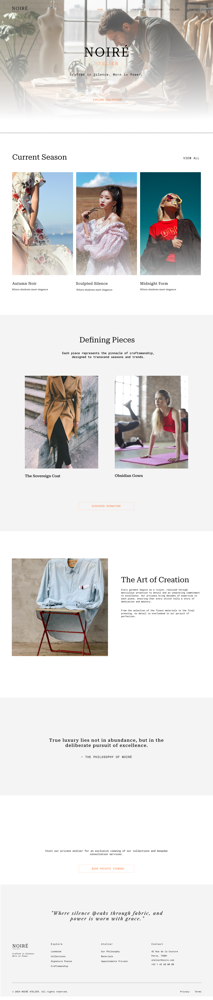
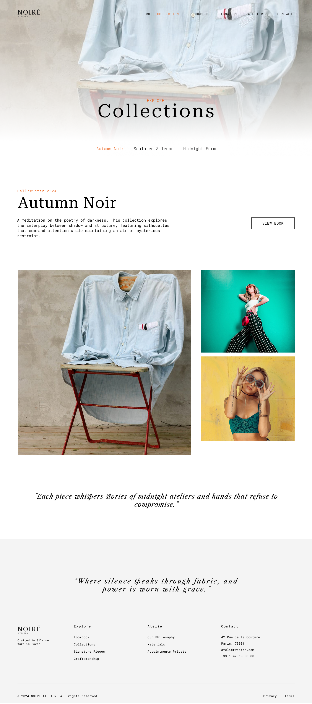
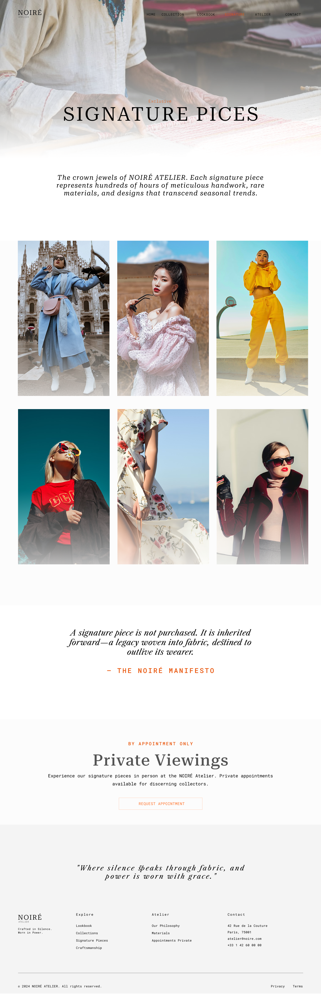
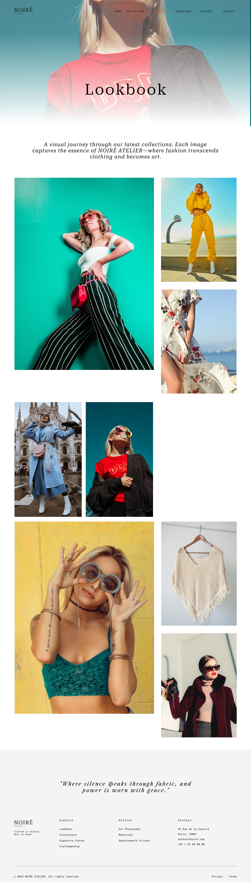
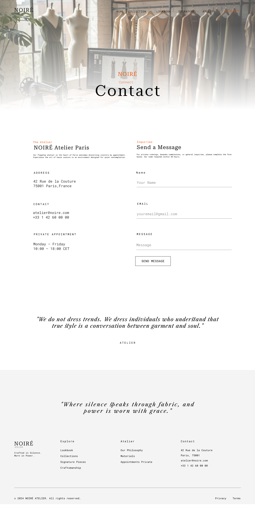

<p align="center">
  
</p>

<h1 align="center">🛍️ Noire</h1>

<p align="center">
  A Premium Fashion E-Commerce Experience designed in Figma and built with React, TypeScript, Tailwind CSS, and Redux Toolkit.
</p>

<p align="center">
  Modern UI • Responsive Design • Smooth Interactions • Brand Storytelling
</p>

<p align="center">
  
  
  
  
  
</p>

<p align="center">
  <a href="YOUR_LIVE_DEMO_LINK">
    
  </a>
  <a href="https://www.figma.com/design/nrhdFFXt8ivLtMVAB7MXaB/Noire?node-id=0-1&t=yXykIwxd1QVq1A2X-1">
    
  </a>
</p>

---

# 📖 About The Project

**Noire** is a modern fashion e-commerce experience created to showcase premium clothing collections through elegant design, refined typography, and seamless user interactions.

The project was first designed in **Figma** and later developed using **React**, **TypeScript**, and **Tailwind CSS**, following modern frontend best practices with reusable components and scalable architecture.

---

# 🎨 Figma Design Showcase

## 🏠 Home

<p align="center">
  
</p>

---

## 🧥 Collection

<p align="center">
  
</p>

---

## ✨ Signature Collection

<p align="center">
  
</p>

---

## 🌙 Midnight Form

<p align="center">
  
</p>

---

## 🖤 Sculpted Silence

<p align="center">
  
</p>

---

## 📖 Lookbook

<p align="center">
  
</p>

---

## 🧵 Craftsmanship

<p align="center">
  
</p>

---

## 🏛️ Experience The Atelier

<p align="center">
  
</p>

---

## 📬 Contact

<p align="center">
  
</p>

---

# ✨ Features

## 🛍️ Shopping Experience

- Elegant Landing Page
- Collection Showcase
- Premium Brand Storytelling
- Responsive Navigation
- Mobile First Design
- Interactive UI Components
- Smooth Animations
- Fast Performance

## 🎨 Design

- Modern Fashion Aesthetic
- Pixel Perfect Layout
- Fully Responsive
- Clean Typography
- Reusable Components
- Accessibility Focused

---

# 🛠️ Tech Stack

## 🎨 Frontend

- React
- TypeScript
- Tailwind CSS
- Redux Toolkit
- shadcn/ui
- React Router DOM

## 🎯 Design

- Figma

## ⚙️ Development

- Vite
- ESLint

---

# 📂 Project Structure

```text
Noire
│
├── public/
│   ├── HOME.png
│   ├── Collection.png
│   ├── SIGNATURE.png
│   ├── LOOKBOOK.png
│   ├── Sculpted Silence.png
│   ├── Midnight Form.png
│   ├── Experience the Atelier.png
│   ├── CRAFTMANSHIP.png
│   ├── contact.png
│   └── p1.png
│
├── src/
│   ├── assets/
│   ├── components/
│   ├── hooks/
│   ├── lib/
│   ├── pages/
│   ├── redux/
│   ├── App.tsx
│   └── main.tsx
│
├── package.json
├── vite.config.ts
├── tailwind.config.ts
├── tsconfig.json
└── README.md
```

---

# ⚙️ Installation

## Clone Repository

```bash
git clone https://github.com/AdityaSarse/Noire.git
```

```bash
cd Noire
```

## Install Dependencies

```bash
npm install
```

## Start Development Server

```bash
npm run dev
```

---

# 🎯 Design Philosophy

The design focuses on creating a premium fashion experience through simplicity, elegant typography, whitespace, and immersive storytelling.

The complete interface was first designed in **Figma**, then translated into reusable React components using Tailwind CSS while maintaining consistency, responsiveness, and accessibility.

---

# 🧠 State Management

Redux Toolkit is used for:

- Managing global UI state
- Handling product collections
- Creating scalable and predictable data flow
- Improving component communication

---

# 🚀 Future Improvements

- 🛒 Shopping Cart
- ❤️ Wishlist
- 🔍 Product Search
- 💳 Secure Checkout
- 👤 User Authentication
- 🌐 Multi-language Support
- 📊 Analytics Dashboard
- 🧑‍🎨 CMS Integration

---

# 👨‍💻 Author

## Aditya Sarse

Full Stack Developer

### 📬 Contact

- 📧 Email: **adityasarse362@gmail.com**
- 💼 LinkedIn: *(Add Your LinkedIn)*
- 🌐 Portfolio: *(Add Portfolio Link)*

---

<p align="center">
⭐ If you like this project, consider giving it a star!
</p>
